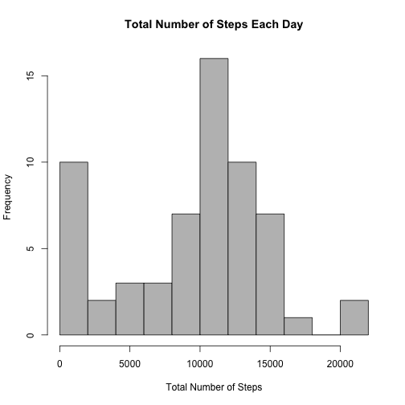
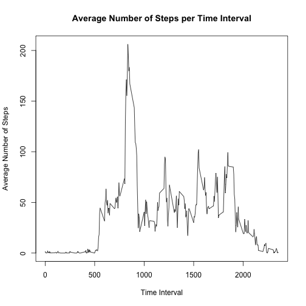
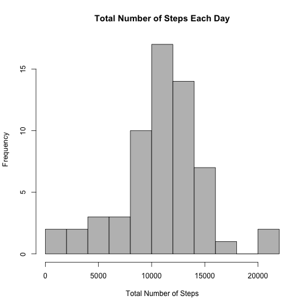
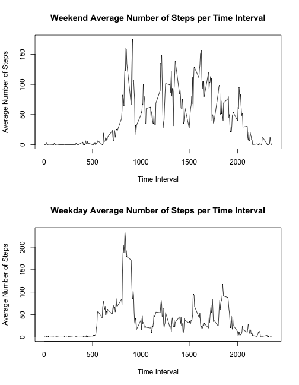

Reproducible Research: Course Project 1  
=======================================  
1.  Code for reading in the dataset and/or processing the data

```r
activity <- read.table(file="/Users/joe/Downloads/activity.csv", header=T, sep=",")
dim(activity)
```

```
## [1] 17568     3
```

```r
summary(activity)
```

```
##      steps                date          interval     
##  Min.   :  0.00   2012-10-01:  288   Min.   :   0.0  
##  1st Qu.:  0.00   2012-10-02:  288   1st Qu.: 588.8  
##  Median :  0.00   2012-10-03:  288   Median :1177.5  
##  Mean   : 37.38   2012-10-04:  288   Mean   :1177.5  
##  3rd Qu.: 12.00   2012-10-05:  288   3rd Qu.:1766.2  
##  Max.   :806.00   2012-10-06:  288   Max.   :2355.0  
##  NA's   :2304     (Other)   :15840
```

Marking a variable indicating the day of the week for each observation

```r
activity$day_of_week <- weekdays(as.Date(activity$date))
table(activity$day_of_week)
```

```
## 
##    Friday    Monday  Saturday    Sunday  Thursday   Tuesday Wednesday 
##      2592      2592      2304      2304      2592      2592      2592
```
  
  
2. Histogram of the total number of steps taken each day  

```r
date_steps <- tapply(activity$steps, activity$date, sum, na.rm=T)
print(date_steps)
```

```
## 2012-10-01 2012-10-02 2012-10-03 2012-10-04 2012-10-05 2012-10-06 
##          0        126      11352      12116      13294      15420 
## 2012-10-07 2012-10-08 2012-10-09 2012-10-10 2012-10-11 2012-10-12 
##      11015          0      12811       9900      10304      17382 
## 2012-10-13 2012-10-14 2012-10-15 2012-10-16 2012-10-17 2012-10-18 
##      12426      15098      10139      15084      13452      10056 
## 2012-10-19 2012-10-20 2012-10-21 2012-10-22 2012-10-23 2012-10-24 
##      11829      10395       8821      13460       8918       8355 
## 2012-10-25 2012-10-26 2012-10-27 2012-10-28 2012-10-29 2012-10-30 
##       2492       6778      10119      11458       5018       9819 
## 2012-10-31 2012-11-01 2012-11-02 2012-11-03 2012-11-04 2012-11-05 
##      15414          0      10600      10571          0      10439 
## 2012-11-06 2012-11-07 2012-11-08 2012-11-09 2012-11-10 2012-11-11 
##       8334      12883       3219          0          0      12608 
## 2012-11-12 2012-11-13 2012-11-14 2012-11-15 2012-11-16 2012-11-17 
##      10765       7336          0         41       5441      14339 
## 2012-11-18 2012-11-19 2012-11-20 2012-11-21 2012-11-22 2012-11-23 
##      15110       8841       4472      12787      20427      21194 
## 2012-11-24 2012-11-25 2012-11-26 2012-11-27 2012-11-28 2012-11-29 
##      14478      11834      11162      13646      10183       7047 
## 2012-11-30 
##          0
```

```r
hist(date_steps, xlab="Total Number of Steps", main="Total Number of Steps Each Day", col="grey", breaks=10)
```

 


3. Mean and median number of steps taken each day

```r
mean(date_steps)
```

```
## [1] 9354.23
```

```r
median(date_steps)
```

```
## [1] 10395
```


4. Time series plot of the average number of steps taken

```r
interval_steps <- tapply(activity$steps, activity$interval, mean, na.rm=T)
plot(names(interval_steps), interval_steps, type="l", xlab="Time Interval", ylab="Average Number of Steps", main="Average Number of Steps per Time Interval")
```

 


5. The 5-minute interval that, on average, contains the maximum number of steps

```r
names(interval_steps)[which(interval_steps == max(interval_steps))]
```

```
## [1] "835"
```

6. Code to describe and show a strategy for imputing missing data

```r
# Total number of missing values
sum(is.na(activity$steps))
```

```
## [1] 2304
```

```r
# Proportion
mean(is.na(activity$steps))
```

```
## [1] 0.1311475
```

```r
# Imuputing missing number of steps per interval using Poisson regression
p_fit <- glm(steps ~ interval + day_of_week, data=activity, family=poisson)
summary(p_fit)
```

```
## 
## Call:
## glm(formula = steps ~ interval + day_of_week, family = poisson, 
##     data = activity)
## 
## Deviance Residuals: 
##     Min       1Q   Median       3Q      Max  
## -10.324   -8.848   -8.115   -5.046   62.177  
## 
## Coefficients:
##                        Estimate Std. Error z value Pr(>|z|)    
## (Intercept)           3.542e+00  4.176e-03 848.079  < 2e-16 ***
## interval              1.784e-04  1.921e-06  92.889  < 2e-16 ***
## day_of_weekMonday    -2.144e-01  5.087e-03 -42.141  < 2e-16 ***
## day_of_weekSaturday   1.412e-02  4.791e-03   2.947  0.00321 ** 
## day_of_weekSunday    -6.657e-03  4.816e-03  -1.382  0.16691    
## day_of_weekThursday  -4.088e-01  5.174e-03 -78.994  < 2e-16 ***
## day_of_weekTuesday   -3.228e-01  4.896e-03 -65.938  < 2e-16 ***
## day_of_weekWednesday -4.713e-02  4.707e-03 -10.011  < 2e-16 ***
## ---
## Signif. codes:  0 '***' 0.001 '**' 0.01 '*' 0.05 '.' 0.1 ' ' 1
## 
## (Dispersion parameter for poisson family taken to be 1)
## 
##     Null deviance: 2222359  on 15263  degrees of freedom
## Residual deviance: 2199381  on 15256  degrees of freedom
##   (2304 observations deleted due to missingness)
## AIC: 2224730
## 
## Number of Fisher Scoring iterations: 7
```

```r
imputed_values <- predict(p_fit, activity, type="response")

# New dataset with imputed missing steps
activity_imputed <- activity

# Apply imputed values to NAs
activity_imputed$impute_steps <- activity_imputed$steps # non missing same as steps
activity_imputed$impute_steps[which(is.na(activity_imputed$steps))] <- imputed_values[which(is.na(activity_imputed$steps))] # missing get imputed value
# Check that imputation was applied and no NA values exist in impute_steps variable
sum(is.na(activity_imputed$impute_steps))
```

```
## [1] 0
```

7. Histogram of the total number of steps taken each day after missing values are imputed

```r
# Histogram of imputed steps
date_impute_steps <- tapply(activity_imputed$impute_steps, activity_imputed$date, sum)
hist(date_impute_steps, xlab="Total Number of Steps", main="Total Number of Steps Each Day", col="grey", breaks=10)
```

 

```r
# Mean and Median of inputed steps
mean(date_impute_steps)
```

```
## [1] 10821.21
```

```r
median(date_impute_steps)
```

```
## [1] 11015
```

```r
# Do the values differ from the estimate from the first part?
t.test(date_steps, date_impute_steps, paired=T)
```

```
## 
## 	Paired t-test
## 
## data:  date_steps and date_impute_steps
## t = -2.9789, df = 60, p-value = 0.00417
## alternative hypothesis: true difference in means is not equal to 0
## 95 percent confidence interval:
##  -2452.0387  -481.9216
## sample estimates:
## mean of the differences 
##                -1466.98
```

```r
wilcox.test(date_steps, date_impute_steps, paired=T, exact=F, conf.int=T)
```

```
## 
## 	Wilcoxon signed rank test with continuity correction
## 
## data:  date_steps and date_impute_steps
## V = 0, p-value = 0.01403
## alternative hypothesis: true location shift is not equal to 0
## 95 percent confidence interval:
##  -12406.571  -9974.857
## sample estimates:
## (pseudo)median 
##      -11167.29
```

Paired ttest and paired wilcoxon signed rank test show a significant difference between mean of paired difference and median of paired difference.  Both the mean and median of the non-imputed minus imputed paired differences have negative estimates, which shows that the imputated values are higher than the non-imputed values.
  
  
8.Panel plot comparing the average number of steps taken per 5-minute inteval across weekdays and weekends

```r
activity_imputed$weekday <- factor(activity_imputed$day_of_week %in% c("Monday", "Tuesday", "Wednesday", "Thursday", "Friday"), labels=c("Weekend", "Weekday"))

table(activity_imputed$weekday)
```

```
## 
## Weekend Weekday 
##    4608   12960
```

```r
interval_steps_weekday <- tapply(activity_imputed$steps, list(activity_imputed$interval, activity_imputed$weekday), mean, na.rm=T)


layout(matrix(c(1,2), 2, 1))
plot(names(interval_steps_weekday[,1]), interval_steps_weekday[,1], type="l", xlab="Time Interval", ylab="Average Number of Steps", main=paste(colnames(interval_steps_weekday)[1],"Average Number of Steps per Time Interval"))
plot(names(interval_steps_weekday[,2]), interval_steps_weekday[,2], type="l", xlab="Time Interval", ylab="Average Number of Steps", main=paste(colnames(interval_steps_weekday)[2],"Average Number of Steps per Time Interval"))
```

 
